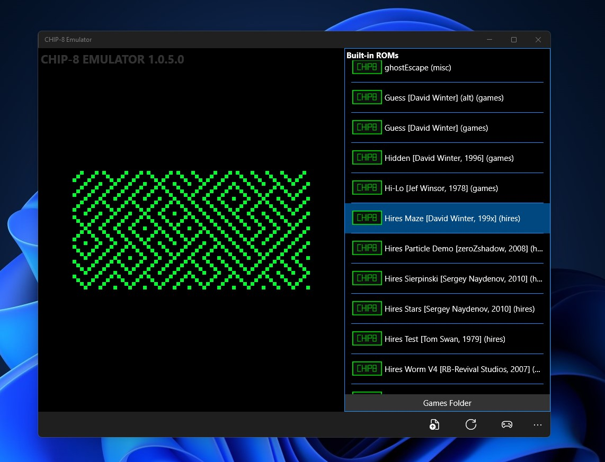

   
  <b>Enhanced CHIP-8 Emulator based on UWPChip8 by Jody Andrews</b> 
  <a href="./src">Source</a> |
  <a href="https://github.com/JodyAndrews/UWPChip8">Original Project</a> 
    
    

# Features

- ROMs List
- Built-in ROMs
- Touch Keyboard
- Screen colors (Green, Red, Blue..etc)
- Emulator Sounds
- Sound Profiles
- Bugs fixes

# Target

It will work with build 10586 and above, ARM - x64 - x86

# Credits

Developed by Jody Andrews

Enhanced by Bashar Astifan